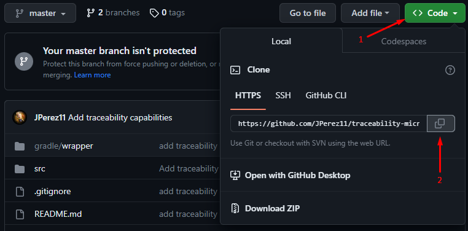

<br>
<div>
<h3 style="text-align: center">PRAGMA POWER-UP</h3>
  <p style="text-align: center">
    In this challenge you are going to design the backend of a system that centralizes the services and orders of a restaurant chain that has different branches in the city.
  </p>
<p style="text-align: center">
   This microservice is responsible for recording the traceability of each transaction of customer orders.
</p>
</div>

### Built With

* 
* 
* 
* 
* 


<!-- GETTING STARTED -->
## Getting Started

To get a local copy up and running follow these steps.

### Prerequisites

* JDK 17 [https://jdk.java.net/java-se-ri/17](https://jdk.java.net/java-se-ri/17)
* Gradle [https://gradle.org/install/](https://gradle.org/install/)

### Recommended Tools
* IntelliJ Community [https://www.jetbrains.com/idea/download/](https://www.jetbrains.com/idea/download/)
* Postman [https://www.postman.com/downloads/](https://www.postman.com/downloads/)

### Installation

###### Recommendation: Watch the following video ######

<br>LINKS:
<br> https://youtu.be/xIQZolmvbtM - Project explained
<br> https://youtu.be/PLQHsIf7g5g - Additional project settings

1. Clone the repository
   <br>
   <b>Steps:</b>
   <br>
   1. Press the green ``code`` button and press the copy button to copy the link
      <br><br>
      
      <br><br>
   2. Open a terminal like Git Bash and type the command ``git clone`` + the repository link copied earlier
   ```shell
   git clone https://github.com/JPerez11/traceability-microservice
   ```
   3. Change directory
   ```shell
   cd traceability-microservice
   ```

<!-- USAGE -->
## Usage

1. Right-click the class TraceabilityMicroserviceApplication and choose Run
2. Open [http://localhost:8093/swagger-ui/index.html](http://localhost:8093/swagger-ui/index.html) in your web browser

<!-- ROADMAP -->
## Tests

- Right-click the test folder and choose Run tests with coverage
